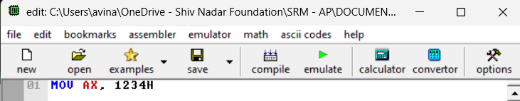
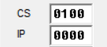
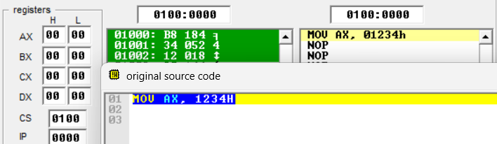
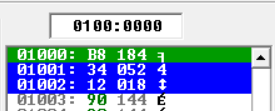
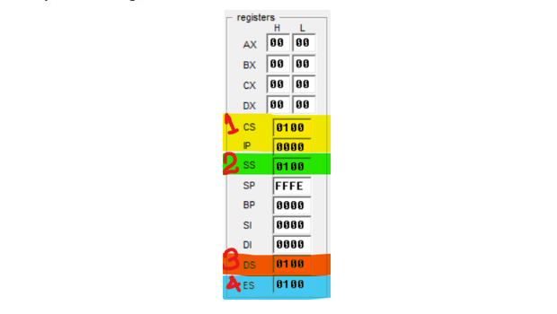
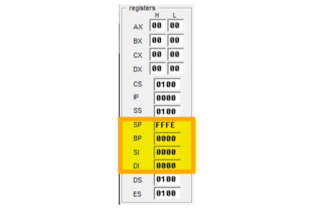
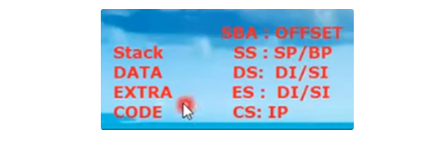

# EMU8086 Overview 🔢

This README provides an overview of the EMU8086 emulator and details a basic assembly language program using TASM (Turbo Assembler). The guide walks through the EMU8086 interface, including the main editor, source code window, binary file window, and key registers used in assembly language programming.

---

# EMU8086 Interface Overview ♻️

## Emulation Windows 💻

When you click the “**EMULATE**” button in EMU8086, three windows appear:

1. **Main Editor**: The primary interface where you write and edit assembly code. <br>
    <br><br>
2. **Source Code Window**: Displays the assembly code in a separate window for easy reference.<br>
    <br><br>
3. **Binary File Window**: Shows the binary equivalent of the assembly instructions.<br>
    <br><br>

## Data Registers 0️⃣1️⃣

The **Data Registers** include AX, BX, CX, and DX, which are used for general-purpose data manipulation in 8086 assembly programs.

 <br><br>

## Code Segment and Instruction Pointer (CS:IP) 🧑‍💻

- **Code Segment (CS)** and **Instruction Pointer (IP)** registers are critical for generating physical memory addresses.
- These two registers generate physical addresses of memory.
- 8086 uses a combination of these two registers to calculate a 20-bit physical address, allowing access to memory beyond the 16-bit limitation.
- We know that the memory which is attached to 8086, the physical address of each location, is around 20 bit but the 8086 microprocessor is a 16 bit microprocessor and we can not access 20 bit locations using 16 bits microprocessor.
- So there are two 16 bits registers which are involved to generate the physical address and those are:
  - Segment Registers and
  - Offset Registers
- Code Segment Register is solely dedicated to codes/programs/instructions. Example: **`MOV AX, 1234H`**
- Every segment has to use two different pointers, one pointer is known as Segment Based Address which is the segment register and the other is offset address and for code segment it is IP.
- Code Segment will provide segment base address.
- For code segment, segment base register is CS register and offset part is IP register.
- So both of these two registers constitute 20 bit register.

- **Physical Address Calculation**: `Physical Address = CS * 10h + IP` 🎲

  - Segment Base Address( which is the value of CS) multiplied by 10 plus offset(which is IP) ⇒
    CS \* 10 + Offset

     <br><br>

    Example:
    If `CS = 0100h` and `IP = 0000h`, the physical address is calculated as:

    ```assembly
    Physical Address = 0100h * 10h + 0000h = 01000h

    From the above image:
    = CS * 10 + Offset
    = CS * 10 + IP
    = 0100 * 10 + 0000
    = 01000 + 0000
    = 01000             ←            (Physical Address)
    ```

    This address is where the instruction will be stored in memory.

    How many bits are these now?

    These are 5 hexa-decimal symbols so these are 20 bits now. So this is a 20 bit address.

    To find in which memory location the instruction is placed :

    - Since the code MOV AX, 1234H is an assembly instruction and we know that when it is going to be written inside Code Segment, it is either going to be written in the terms of binary or hexa-decimal or machine code.
    - So 1234H will be written at the address 01000 as calculated above.
    - So when we click on the code in original source code window then the corresponding binary code in the binary code window gets highlighted in green as below
    - So the first code(01000) indicates the Physical Address. Furthermore these are 3 different location that got highlighted because the taken assembly language is of 3 byte so every locations consumes one byte.
    - So **1234H** is converted into 3 bytes as **B8** **34** **12**

     <br><br>

- **Logical Address:**

  - So the logical address will be written as:
    **`CS : IP`**
  - So from the above example logical address will be:
    **`CS : IP  =  0100 : 0000`**

     <br><br>

## **Stack Segment Register (SS)** 💪

- Each segment has a Segment Base Address (SBA) and an Offset part.
- There are 4 different kinds of segments in memory. The segment registers are:

  - **Code Segment,**
  - **Stack Segment,**
  - **Data Segment and**
  - **Heap/Extra Segment**

   <br><br>

- For every segments we have **_Segment Base Address (SBA)_** and **_Offset_** part; And for Segment Base Address we use segment registers. As in code segment we were using Code Segment (CS)
- The SS (2), DS (3), and ES (4) are actually showing the segment base address of their corresponding segments.
- The below four registers are used for offset areas
  - Stack Pointer (SP)
  - Base Pointer (BP)
  - Source Index (SI)
  - Destination Index (DI)
- And offset parts are shown in the below 4 parts:

   <br><br>

- Stack Pointer (SP) and Base Pointer (BP) are the offset registers of the Stack Segment Register and
- Source Index (SI) and Destination Index (DI) are the offset registers of the Data Segment Register.

   <br><br>

## Sample Code Block Skeleton

```assembly
.MODEL SMALL           ; Define the memory model as SMALL, allowing for up to 64 KB of code and 64 KB of data.
.STACK 100H            ; Reserve 256 bytes (100H) for the stack, used for temporary storage during program execution.

.DATA                  ; Begin the data segment where variables, constants, and other data are defined.

    ; Example data declarations
    VAR1 DB 10H        ; Declare an 8-bit (1 byte) variable named VAR1 and initialize it with the value 10H (16 in decimal).
    VAR2 DW 1234H      ; Declare a 16-bit (2 bytes) variable named VAR2 and initialize it with the value 1234H (4660 in decimal).
    MESSAGE DB 'Hello, World!', '$'  ; Declare a string terminated by '$', required by DOS for output.

.CODE                  ; Begin the code segment where the instructions (logic) of the program are defined.

MAIN PROC              ; Start the main procedure. This is where the program's execution begins.

    MOV AX, @DATA      ; Load the address of the data segment into the AX register.
    MOV DS, AX         ; Initialize the DS register with the value in AX, pointing DS to the data segment.

    ; Example operation: Load VAR1 into AL, add VAR2's lower byte, and store the result back in VAR1.
    MOV AL, VAR1       ; Move the value of VAR1 into the AL register (8-bit).
    ADD AL, [VAR2]     ; Add the lower byte of VAR2 to AL.
    MOV VAR1, AL       ; Store the result back into VAR1.

    ; Example operation: Display a message on the screen.
    LEA DX, MESSAGE    ; Load the effective address of MESSAGE into the DX register.
    MOV AH, 09H        ; DOS interrupt function to display a string.
    INT 21H            ; Call DOS interrupt 21H to display the string in DX.

    ; Terminate the program.
    MOV AH, 4CH        ; DOS interrupt function to terminate the program.
    INT 21H            ; Call DOS interrupt 21H to exit the program.

MAIN ENDP              ; End the main procedure.

END MAIN               ; Mark the end of the program and specify the starting point of execution.
```

## Detailed Description of Each Part:

1. `.MODEL SMALL`

   - **Purpose**: This directive specifies the memory model used by the program.
   - **Explanation**: The `SMALL` memory model is one of the several memory models available in 8086 assembly language. It indicates that both the code (instructions) and data (variables) will fit within a single segment, each up to 64 KB. This is suitable for small programs where the total size of the code and data is less than 64 KB.

2. `.STACK 100H`

   - **Purpose**: This directive reserves space for the stack.
   - **Explanation**: The stack is a special area of memory used for storing temporary data, such as return addresses, local variables, and passed arguments. The `100H` specifies the size of the stack as 256 bytes (`100H` in hexadecimal). The stack is often used in subroutine calls and interrupt handling.

3. `.DATA`

   - **Purpose**: This section is used to define variables and constants and Marks the beginning of the data segment.
   - **Explanation**: The `.DATA` directive marks the beginning of the data segment where variables, constants, and other data are defined that the program will use. Anything defined in this section will be stored in the data segment (DS). Typically, you'd define things like strings, numbers, or arrays here. In this example:
     - `VAR1` is an 8-bit variable initialized to `10H`.
     - `VAR2` is a 16-bit variable initialized to `1234H`.
     - `MESSAGE` is a string that ends with a `$`, used by DOS to identify the end of the string.

4. `.CODE`

   - **Purpose**: This section is used to define the actual instructions (code) of the program. Marks the beginning of the code segment.
   - **Explanation**: The `.CODE` directive marks the beginning of the code segment where the program instructions are written. This is where the actual logic of the program resides. This section contains the instructions that the CPU will execute. It typically includes the program’s logic and operations.

5. `MAIN PROC` and `MAIN ENDP`

   - **Purpose**: `PROC` define the main procedure(subroutine) of the program and `MAIN ENDP` marks the end of the MAIN procedure.
   - **Explanation**:
     - `PROC` is a directive that defines the start of a procedure (or function). `MAIN` is the name of the procedure, often used as the entry point of the program. This is where the CPU will start executing the program's instructions.
     - `ENDP` is the directive that signals the end of the procedure named `MAIN`. It pairs with the corresponding `PROC` directive.

6. `MOV AX, @DATA` and `MOV DS, AX`

   - **Purpose**: Set up the data segment register.
   - **Explanation**: The address of the data segment is loaded into the `AX` register and then moved into the DS register. This is necessary to access variables defined in the `.DATA` section.

7. **Example Operations**:

   - **Load and Add**:

     - `MOV AL, VAR1` loads the value of `VAR1` into the AL register (an 8-bit general-purpose register).
     - `ADD AL, [VAR2]` adds the lower byte of `VAR2` to the value in `AL`.
     - `MOV VAR1, AL` stores the result back into `VAR1`.

   - **Display a Message**:
     - `LEA DX, MESSAGE` loads the address of `MESSAGE` into the DX register.
     - `MOV AH, 09H` prepares for the `DOS` interrupt to print a string.
     - `INT 21H` calls the interrupt to display the string.

8. **Program Termination**:

   - **Purpose**: Gracefully end the program and return control to the operating system.
   - **Explanation**: `MOV AH, 4CH` sets the function to terminate the program, and INT 21H executes it.

9. `END MAIN`

   - **Purpose**: This directive tells the assembler where the program ends and which procedure is the starting point of execution and Marks the end of the program.
   - **Explanation**: The `END` directive tells the assembler that this is the end of the program. The operand `MAIN` indicates that the execution should start from the `MAIN` procedure.

## Summary:

- The `.MODEL SMALL` directive defines a small memory model.
- The `.STACK 100H` directive reserves 256 bytes of space for the stack.
- The `.DATA` section is where variables and constants are declared.
- The `.CODE` section contains the program's executable instructions.
- `MAIN PROC` begins the main procedure where the program's logic starts.
- `MAIN ENDP` marks the end of the MAIN procedure.
- `END MAIN` tells the assembler to start execution at the MAIN procedure and marks the end of the program.

<br><br>

## Sample Code For Understanding: 🔥

Here’s a simple "Hello, World!" program written in assembly language for TASM:

```assembly
; Hello World program in assembly language for TASM

.model small
.stack 100h

.data
    hello_msg db 'Hello, World!$', 0

.code
main:
    mov ax, @data      ; Load data segment
    mov ds, ax         ; Set DS register

    lea dx, hello_msg  ; Load address of message into DX
    mov ah, 9          ; Function 9: Display string
    int 21h            ; Call DOS interrupt

    mov ah, 4Ch        ; Function 4Ch: Exit program
    int 21h            ; Call DOS interrupt

end main
```

This assembly program displays "Hello, World!" on the screen using DOS interrupts. It loads the data segment into the `DS` register, then uses the `lea` instruction to load the address of the `hello_msg` string into `DX`. Finally, it calls interrupt `21h` to display the string and exit the program.

🎭🎭🎭🎭🎭

---

---
