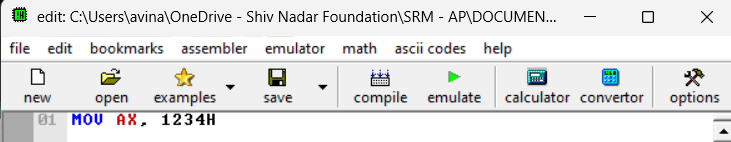
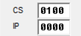
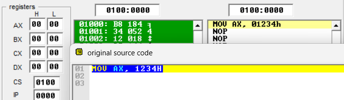
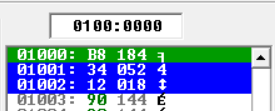
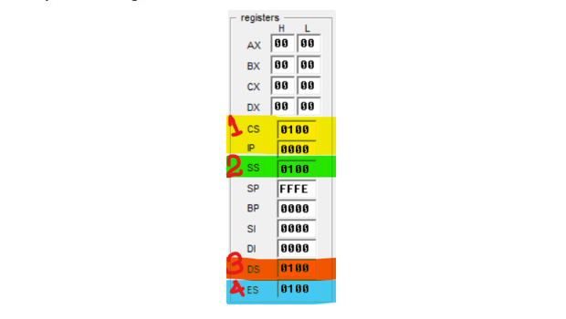
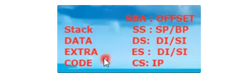

# EMU8086 Overview 🔢

This README provides an overview of the EMU8086 emulator and details a basic assembly language program using TASM (Turbo Assembler). The guide walks through the EMU8086 interface, including the main editor, source code window, binary file window, and key registers used in assembly language programming.

---

## EMU8086 Interface Overview ♻️

### Emulation Windows 💻

When you click the “**EMULATE**” button in EMU8086, three windows appear:

1. **Main Editor**: The primary interface where you write and edit assembly code.
    <br><br>
2. **Source Code Window**: Displays the assembly code in a separate window for easy reference.
    <br><br>
3. **Binary File Window**: Shows the binary equivalent of the assembly instructions.
    <br><br>

---

### Data Registers 0️⃣1️⃣

The **Data Registers** include AX, BX, CX, and DX, which are used for general-purpose data manipulation in 8086 assembly programs.

 <br><br>

---

### Code Segment and Instruction Pointer (CS:IP) 🧑‍💻

- **Code Segment (CS)** and **Instruction Pointer (IP)** registers are critical for generating physical memory addresses.
- These two registers generate physical addresses of memory.
- 8086 uses a combination of these two registers to calculate a 20-bit physical address, allowing access to memory beyond the 16-bit limitation.
- We know that the memory which is attached to 8086, the physical address of each location, is around 20 bit but the 8086 microprocessor is a 16 bit microprocessor and we can not access 20 bit locations using 16 bits microprocessor.
- So there are two 16 bits registers which are involved to generate the physical address and those are:
  - Segment Registers and
  - Offset Registers
- Code Segment Register is solely dedicated to codes/programs/instructions. Example: **`MOV AX, 1234H`**
- Every segment has to use two different pointers, one pointer is known as Segment Based Address which is the segment register and the other is offset address and for code segment it is IP.
- Code Segment will provide segment base address.
- For code segment, segment base register is CS register and offset part is IP register.
- So both of these two registers constitute 20 bit register.

- **Physical Address Calculation**: `Physical Address = CS * 10h + IP` 🎲

  - Segment Base Address( which is the value of CS) multiplied by 10 plus offset(which is IP) ⇒
    CS \* 10 + Offset

     <br><br>

    Example:
    If `CS = 0100h` and `IP = 0000h`, the physical address is calculated as:

    ```assembly
    Physical Address = 0100h * 10h + 0000h = 01000h

    From the above image:
    = CS * 10 + Offset
    = CS * 10 + IP
    = 0100 * 10 + 0000
    = 01000 + 0000
    = 01000             ←            (Physical Address)
    ```

    This address is where the instruction will be stored in memory.

    How many bits are these now?

    These are 5 hexa-decimal symbols so these are 20 bits now. So this is a 20 bit address.

    To find in which memory location the instruction is placed :

    - Since the code MOV AX, 1234H is an assembly instruction and we know that when it is going to be written inside Code Segment, it is either going to be written in the terms of binary or hexa-decimal or machine code.
    - So 1234H will be written at the address 01000 as calculated above.
    - So when we click on the code in original source code window then the corresponding binary code in the binary code window gets highlighted in green as below
    - So the first code(01000) indicates the Physical Address. Furthermore these are 3 different location that got highlighted because the taken assembly language is of 3 byte so every locations consumes one byte.
    - So **1234H** is converted into 3 bytes as **B8** **34** **12**

     <br><br>

- **Logical Address:**

  - So the logical address will be written as:
    **`CS : IP`**
  - So from the above example logical address will be:
    **`CS : IP  =  0100 : 0000`**

     <br><br>

---

### **Stack Segment Register (SS)** 💪

- Each segment has a Segment Base Address (SBA) and an Offset part.
- There are 4 different kinds of segments in memory. The segment registers are:

  - **Code Segment,**
  - **Stack Segment,**
  - **Data Segment and**
  - **Heap/Extra Segment**

   <br><br>

- For every segments we have **_Segment Base Address (SBA)_** and **_Offset_** part; And for Segment Base Address we use segment registers. As in code segment we were using Code Segment (CS)
- The SS (2), DS (3), and ES (4) are actually showing the segment base address of their corresponding segments.
- The below four registers are used for offset areas
  - Stack Pointer (SP)
  - Base Pointer (BP)
  - Source Index (SI)
  - Destination Index (DI)
- And offset parts are shown in the below 4 parts:

   <br><br>

- Stack Pointer (SP) and Base Pointer (BP) are the offset registers of the Stack Segment Register and
- Source Index (SI) and Destination Index (DI) are the offset registers of the Data Segment Register.

   <br><br>

---

### Sample Code For Understanding: 🔥

Here’s a simple "Hello, World!" program written in assembly language for TASM:

```assembly
; Hello World program in assembly language for TASM

.model small
.stack 100h

.data
    hello_msg db 'Hello, World!$', 0

.code
main:
    mov ax, @data      ; Load data segment
    mov ds, ax         ; Set DS register

    lea dx, hello_msg  ; Load address of message into DX
    mov ah, 9          ; Function 9: Display string
    int 21h            ; Call DOS interrupt

    mov ah, 4Ch        ; Function 4Ch: Exit program
    int 21h            ; Call DOS interrupt

end main
```

This assembly program displays "Hello, World!" on the screen using DOS interrupts. It loads the data segment into the `DS` register, then uses the `lea` instruction to load the address of the `hello_msg` string into `DX`. Finally, it calls interrupt `21h` to display the string and exit the program.

🎭🎭🎭🎭🎭

---

---
