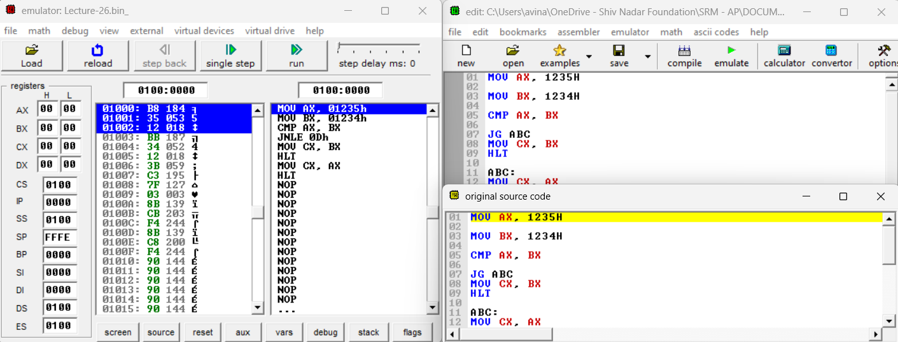
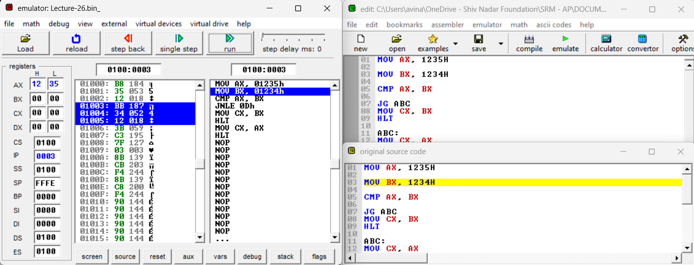
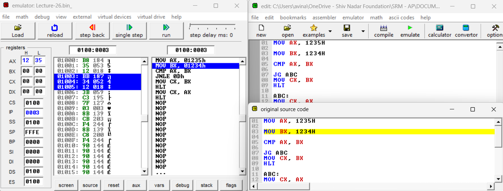
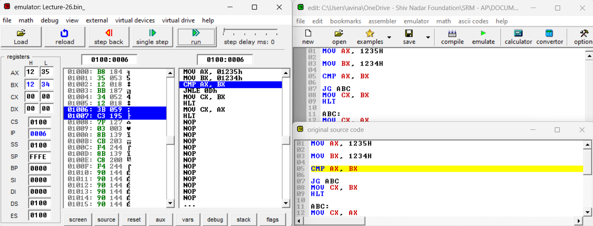
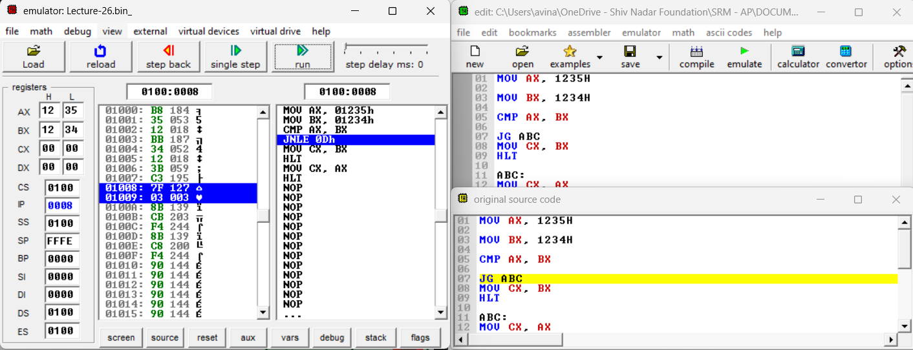
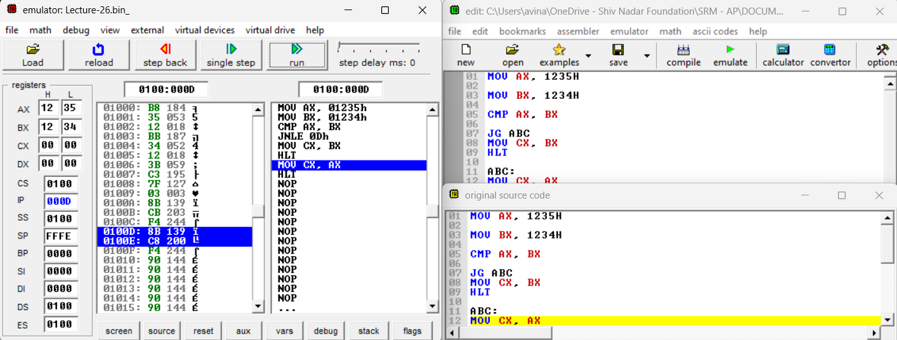
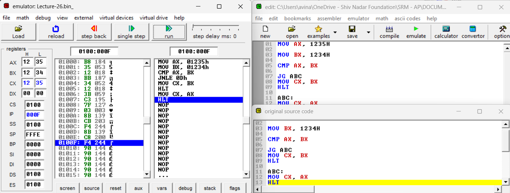

# CMP Instruction ⚖️

## Overview 📝

The `CMP` (Compare) instruction is used to compare two operands by subtracting the source operand from the destination operand. It does not store the result but instead sets the flags in the flag register based on the outcome of the subtraction. These flags can then be used by subsequent conditional jump instructions to alter the flow of the program.

## Instruction Format 📜

```assembly
CMP <destination_operand>, <source_operand>
```

- `destination_operand`: The register or memory location that will be compared.
- `source_operand`: The register, immediate value, or memory location that will be subtracted from the destination operand.
- The `CMP` instruction performs a subtraction of the source operand from the destination operand but does not store the result.
- The operation affects the flags in the flag register, which can then be checked by conditional instructions like `JG`, `JL`, `JE`, etc.

## Explanation 🔍

- The `CMP` instruction is commonly used to compare two values and direct the program flow based on the comparison.
- **Flags Affected**:
- **Zero Flag (ZF)**: Set if the result of the subtraction is zero.
- **Sign Flag (SF)**: Set if the result is negative.
- **Carry Flag (CF)**: Set if there is a borrow in the subtraction (i.e., if the source operand is greater than the destination operand).
- **Overflow Flag (OF)**: Set if there is a signed overflow in the result.

## Conditional Jump Instructions:

- After a `CMP` instruction, you can use conditional jumps to alter the program flow based on the flags:
- `JG`: Jump if greater (signed comparison).
- `JL`: Jump if less (signed comparison).
- `JE`: Jump if equal (zero flag set).

## Example 🧩

### Example: Comparing Two Registers

```assembly
MOV AX, 1235H    ; Load AX with 1235H
MOV BX, 1234H    ; Load BX with 1234H

CMP AX, BX       ; Compare AX with BX (AX - BX)
                 ; Result: 1235H - 1234H = 0001H

JG ABC           ; Jump to label ABC if AX > BX (Jump if greater)
MOV CX, BX       ; This line is skipped because AX > BX
HLT              ; Halt the program

ABC:
MOV CX, AX       ; If jumped, move AX to CX
HLT              ; Halt the program
```

## Step-by-Step Breakdown: 💡

1. **Initial Values**:
   - `AX` = `1235H`
   - `BX` = `1234H`
2. **CMP Instruction**:
   - Performs `AX - BX` which results in `0001H`.
   - Since the result is positive, the `Zero Flag (ZF)` is clear, and the `Sign Flag (SF)` is clear.
   - The `Carry Flag (CF)` is also clear because no borrow is needed.
3. **Conditional Jump**:
   - `JG ABC` checks if `AX` is greater than `BX`.
   - Since `AX > BX`, the program jumps to label `ABC`.
4. **Final Execution**:
   - The instruction at `ABC` is executed, moving the value of `AX` to `CX`.

 <br>
 <br>
 <br>
 <br>
 <br>
 <br>
 <br><br>

## Flags Summary: 🚩

- **Zero Flag (ZF)**: Clear (result is non-zero).
- **Sign Flag (SF)**: Clear (result is positive).
- **Carry Flag (CF)**: Clear (no borrow).
- **Overflow Flag (OF)**: Unaffected in this case.

## Remark Point 🛠️

- The `CMP` instruction is fundamental for making decisions in assembly language based on comparisons.
- Understanding the flag behavior is crucial for correctly using conditional jumps like `JG`, `JL`, `JE`, etc.

---

---

- 🔄 **`CMP allows for flexible control flow based on arithmetic comparisons without altering the actual data in the registers.`**
- 💡 **`Using CMP in combination with conditional jumps is a powerful way to control the flow of an assembly language program based on the comparison of values.`**

---

---

## Sample Code For Understanding: 🔥

Here’s a simple "CMP and Conditional Jump (JG) Instruction" operation program written in assembly language for TASM:

```assembly
; @author: Avinash Yadav
; @file-name: Lecture-26.asm

;;;;;;;;;;;;;;;;;;;;;;;;;;;;;;;;;;;;;;;;;;;;;;
;   CMP and Conditional Jump (JG) Operation  ;
;;;;;;;;;;;;;;;;;;;;;;;;;;;;;;;;;;;;;;;;;;;;;;

; Step 1: Load Immediate Values into AX and BX
; ------------------------------------------------------------
; Move the hexadecimal value 1235H into the AX register.
; AX is a general-purpose 16-bit register.
MOV AX, 1235H    ; AX = 1235H

; Move the hexadecimal value 1234H into the BX register.
; BX is another general-purpose 16-bit register.
MOV BX, 1234H    ; BX = 1234H

; Step 2: Compare AX and BX
; ------------------------------------------------------------
; Compare the value in AX with the value in BX.
; The CMP instruction subtracts the source operand (BX) from the destination operand (AX) and sets the CPU flags based on the result.
; However, it does not store the result; it only affects the flags.
CMP AX, BX

; Step 3: Conditional Jump (JG) Based on the Comparison
; ------------------------------------------------------------
; Jump to the label ABC if the result of the CMP instruction indicates that AX is greater than BX.
; JG (Jump if Greater) checks the flags: it jumps if the result was positive and not equal (i.e., AX > BX).
JG ABC            ; If AX > BX, jump to label ABC

; Step 4: Move BX into CX if AX is not greater than BX
; ------------------------------------------------------------
; If AX is not greater than BX, this instruction is executed.
; Move the value in BX into the CX register.
MOV CX, BX        ; CX = BX (CX = 1234H if AX <= BX)

; Halt the execution of the program.
HLT

; Step 5: Label ABC - Move AX into CX if AX is greater than BX
; ------------------------------------------------------------
; The program execution jumps here if AX was greater than BX.
ABC:
; Move the value in AX into the CX register.
MOV CX, AX        ; CX = AX (CX = 1235H if AX > BX)

; Halt the execution of the program.
HLT

;;;;;;;;;;;;;;;;;;;;;;;;;;;;
;  Detailed Explanation:
;  ----------------------
;  - AX, BX, CX: General-purpose registers in the 8086 microprocessor.
;  - CMP: Compares the destination operand with the source operand by performing a subtraction, but does not store the result.
;         It only affects the flags (Zero Flag, Sign Flag, Overflow Flag, etc.).
;  - JG: Jump if Greater. This instruction causes a jump to the specified label if the previous CMP instruction indicates that the destination operand is greater than the source operand.
;  - HLT: The HLT instruction stops the CPU until a reset or external interrupt occurs.
;
; This code performs the following operations:
; 1. Loads 1235H into AX and 1234H into BX.
; 2. Compares AX with BX.
; 3. If AX is greater than BX, it jumps to label ABC and moves AX into CX.
; 4. If AX is not greater than BX, it moves BX into CX.
; 5. The program halts after these operations.
```
